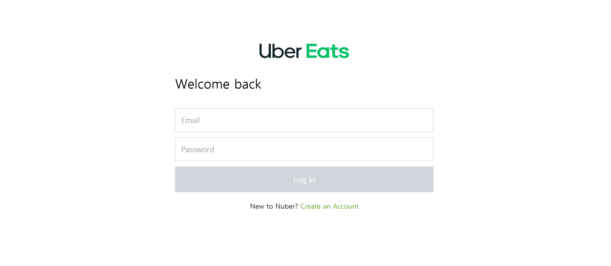
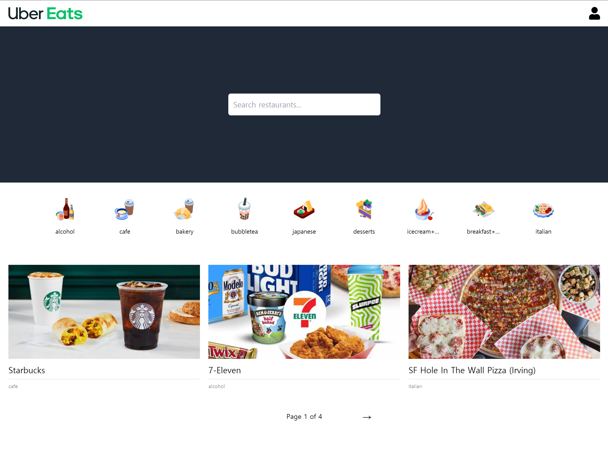
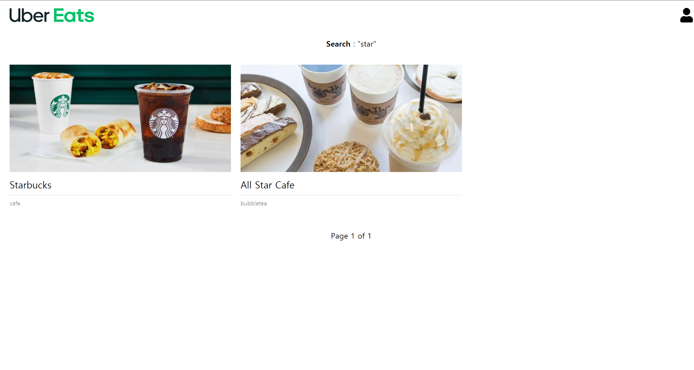
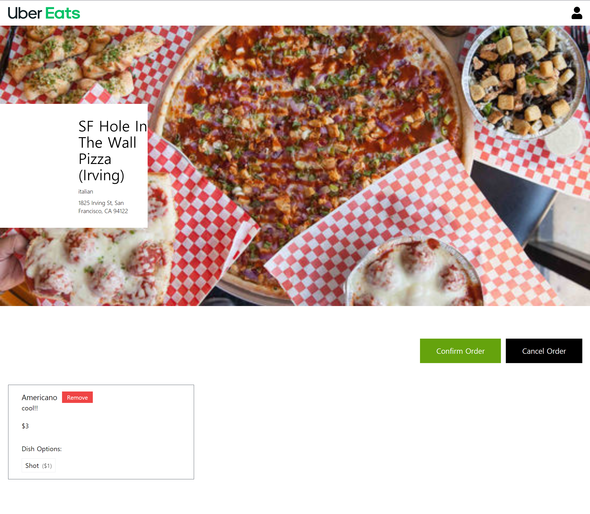

    

# Uber Eats 클론 코딩 : Frontend

## 프로젝트 내용
세계적인 온라인 음식 주문 및 배달 플랫폼인 Uber Eats를 클론 코딩하였습니다.

Owner / Client / Delivery 권한으로 가입할 수 있고 각 권한별로 제공되는 화면이 다릅니다.

Owner는 자기만의 레스토랑을 오픈하여 메뉴를 등록하고 판매할 수 있고, Client의 주문을 실시간으로 확인하여 조리 상태를 변경 할 수 있습니다. 
Client는 오픈된 레스토랑을 검색하여 원하는 메뉴와 옵션을 선택하여 주문할 수 있고, Owner와 Driver가 주문 상태 변경 시 실시간으로 확인할 수 있습니다. 
Delivery는 Owner의 조리 완료 상태를 실시간으로 확인하여 배달 의뢰를 수락할 수 있고, 배달 후 Client와 Owner에게 배달 완료 상태를 실시간으로 알릴 수 있습니다.

NestJS 스터디를 위하여 개인적으로 개발한 사이트입니다.

## 주요 기능
- NestJS를 이용한 Backend 서버 구성
- DTO Schema를 이용한 transformation 및 validation 체크
- AuthGuard를 이용한 Role 권한 분리
- Jest를 이용한 Unit테스트
- Cypress를 이용한 E2E테스트
- Web Socket을 이용한 리얼타임 주문 프로세스 구현

## 사용 기술

## 링크

    <a href="https://nuber-eats-frontend-yjs.netlify.app/" target="_new">https://nuber-eats-frontend-yjs.netlify.app/</a>

## 스크린샷
<video src="./public/screenshot/UberEatsPlay.mp4" width="850" autoplay loop controls muted></video>

